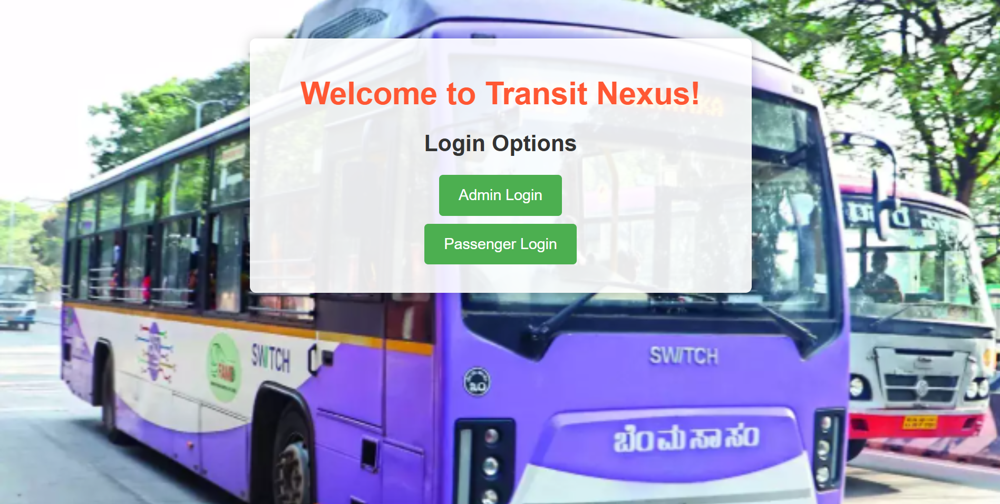
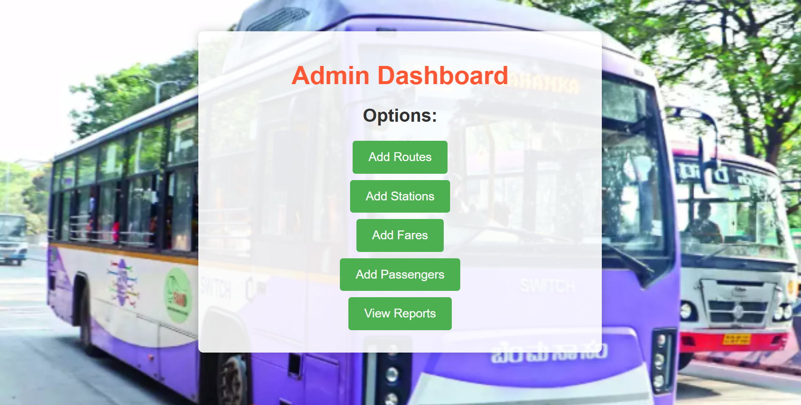
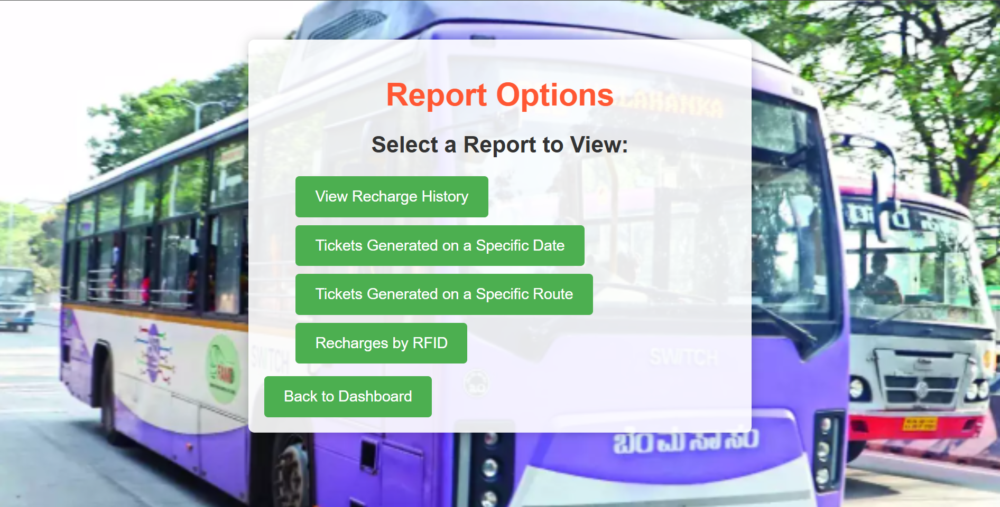

# Transit-Nexus: Ticket Management System

This project is a **Spring Boot-based Ticket Management System** designed for public transportation. It allows administrators to manage routes, stations, passengers, and fares efficiently. Passengers can log in using RFID cards, check their balance, recharge their accounts, and view their ticket history. The system also provides features for generating reports, such as tickets by route or date, and recharge history.



---

## Features

### **For Administrators**
- Add and manage routes, stations, and fares.
- Add and manage passenger details.
- View reports:
  - Tickets by route.
  - Tickets by date.
  - Recharge history by date.

### **For Passengers**
- Login using RFID cards.
- Check balance and recharge accounts.
- View ticket history and recharge history.

---

## Technologies Used
- **Backend**: Spring Boot
- **Frontend**: JSP (Java Server Pages)
- **Database**: PostgreSQL
- **Build Tool**: Maven
- **IDE**: IntelliJ IDEA

---

## Prerequisites
- Java 17 or later
- Maven 3.8 or later
- Git
- PostgreSQL

---

## Setup Instructions

### 1. Clone the Repository
```bash
git clone https://github.com/your-username/Spring-Boot-Ticket-Management.git
cd Spring-Boot-Ticket-Management
```

### 2. Configure the Database
Update the `application.properties` file in `src/main/resources` with your database credentials:
```properties
spring.datasource.url=jdbc:postgresql://localhost:your_localhost/your_database
spring.datasource.username=your_username
spring.datasource.password=your_password
```

### 3. Build the application
Build the project using Maven
```sh
mvn clean install
```

### 3. Run the application
Open your browser and navigate to:
```
http://localhost:8080
```

---

## Database Schema

### 1. Admin Table
Stores administrator login credentials.
```sql
CREATE TABLE Admin (
    admin_id INT AUTO_INCREMENT PRIMARY KEY,
    username VARCHAR(50) NOT NULL UNIQUE,
    password VARCHAR(255) NOT NULL
);
```

### 2. Passenger Table
Stores passenger details, including RFID and balance.
```sql
CREATE TABLE Passenger (
    passenger_id INT AUTO_INCREMENT PRIMARY KEY,
    Rfid_No BIGINT NOT NULL UNIQUE,
    Balance FLOAT DEFAULT 0.0
);
```

### 3. Ticket Table
Stores ticket details for passengers.
```sql
CREATE TABLE Ticket (
    Ticket_No INT AUTO_INCREMENT PRIMARY KEY,
    timestamp DATETIME NOT NULL,
    date DATE NOT NULL,
    StartStop VARCHAR(100) NOT NULL,
    EndStop VARCHAR(100) NOT NULL,
    Rfid_No BIGINT NOT NULL,
    Route_No VARCHAR(50) NOT NULL,
    fare FLOAT NOT NULL,
    FOREIGN KEY (rfid_no) REFERENCES Passenger(rfid_no),
    FOREIGN KEY (route_no) REFERENCES Routes(route_no)
);
```

### 4.  Routes Table
Stores route details.
```sql
CREATE TABLE Routes (
    Route_No VARCHAR(50) PRIMARY KEY,
    Source VARCHAR(100) NOT NULL,
    Destination VARCHAR(100) NOT NULL
);
```

### 5.  Fares Table
Stores fare details between two stations on a specific route.
```sql
CREATE TABLE Fares (
    Fare_id INT AUTO_INCREMENT PRIMARY KEY,
    Route_No VARCHAR(50) NOT NULL,
    Station_1 VARCHAR(100) NOT NULL,
    Station_2 VARCHAR(100) NOT NULL,
    fare FLOAT NOT NULL,
    FOREIGN KEY (Route_no) REFERENCES Routes(Route_no)
);
```

### 6.  Recharge Table
Stores recharge history for passengers.
```sql
CREATE TABLE Recharge (
    recharge_id INT AUTO_INCREMENT PRIMARY KEY,
    Rfid_No BIGINT NOT NULL,
    Recharge_Amount FLOAT NOT NULL,
    Recharge_Date DATE NOT NULL,
    FOREIGN KEY (Rfid_No) REFERENCES Passenger(Rfid_No)
);
```

---

## Screenshots

### 1. Admin Dashboard


### 2. Passenger Dashboard


### 3. Reports


